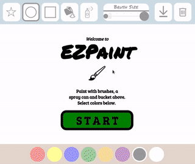
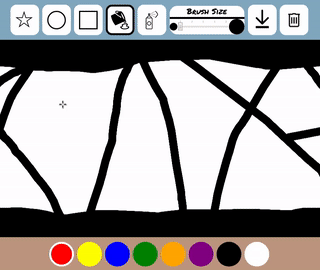

# ezpaint

**Browser-based paint program --** [ezpaint.us](http://www.ezpaint.us)



Here is the project [proposal](PROPOSAL.md).

## Technologies

* HTML5
  * [canvas](https://developer.mozilla.org/en-US/docs/Web/API/Canvas_API)
  * [range](https://developer.mozilla.org/en-US/docs/Web/HTML/Element/input/range)
* CSS3
  * [animations](https://developer.mozilla.org/en-US/docs/Web/API/Canvas_API)
* JavaScript
  * [ES6](http://es6-features.org/)
  * [Webpack 3](https://webpack.github.io/)
    * [Babel](https://github.com/babel/babel-loader)
* [FFMPEG](https://www.ffmpeg.org/) & [SimpleScreenRecorder](http://www.maartenbaert.be/simplescreenrecorder/)
  * Used to make snazzy gifs on my [Linux-running Chromebook](https://galliumos.org/)

## Features

#### Paint with three brush shapes: _Circle, square_ and _Star_.

The circle was implemented with canvas' ```arc```, and the square with ```fillRect```. The star was more complicated, using ```moveTo``` and ```lineTo```.

#### Responsive CSS

There's a brief stylesheet for handling mobile display. It uses a few ```@media``` queries to resize elements when the screen is in portrait mode (screen height > screen width).

```css
@media all and (orientation: portrait) {
  #splash {
    font-size: 2.5em;
  }
  /* remaining CSS omitted... */
}
```

#### Mobile Support - Touch Events

I wanted this app to work on smartphones and adjusting CSS wasn't enough. In order to add **touch support** I had to add event listeners for ```touchstart```, ```touchend``` and ```touchmove```. This was easy thanks to an array-based approach:

```js
['touchstart', 'mousedown'].forEach(ev =>
  canvas.addEventListener(ev, e => {
    this.mouse.isDown = true
    this.handleMouseMove(e)
    // remaining code and event listeners omitted...
  }));
```

I also had to modify my code to handle ```event.touches```, which is an array of coordinate objects that represent touches on the screen. I tackled this by extracting the coordinates from the touch events and calling ```handleMouseMove``` with "fake" events:

```js
handleMouseMove(e){
  /* ...prior code omitted */
  const { touches } = e
  if (touches)
    if (touches.length == 1)
      x = touches[0].clientX, y = touches[0].clientY;
    else if (touches.length > 1) {
      touches.forEach(t => this.handleMouseMove({
        x: t.clientX, y: t.clientY
      }));
      return
    }
    /* remaining code omitted... */
}
```

Dropping this code in was quick and easy, and most importantly, it let me **reuse** my already existing ```handleMouseMove``` function.


#### Fill regions with a bucket fill tool



This was implemented using the [flood fill](https://en.wikipedia.org/wiki/Flood_fill) algorithm and a hash of hashes to store visited pixels:

```js
class CoordinateHash {
  constructor(coord){ this.hash = {} }
  set({ x, y }){
    const { hash } = this

    if (hash[x])
      hash[x][y] = true
    else
      hash[x] = { [y]: true }
  }
  get({ x, y }){
    const { hash } = this
    return !hash[x] ? false : Boolean(hash[x][y])
  }
}
```
I tried other methods of storing visited pixels, including hashing their coordinates using the [Cantor Pairing](https://en.wikipedia.org/wiki/Pairing_function#Cantor_pairing_function) function, but a hash of hashes was over twice as fast. I also tried turning coordinates into strings, but that was slower too.

On my Chromebook or mobile phone, filling the entire screen can take upwards of six seconds. It would be nice to reduce this. To provide some user feedback, the cursor changes to the waiting spinner. Another thing I'd like to do is use Web Workers to send the flood fill process to the background.

#### Spray can tool

This effect was easy to implement; If the tool is selected, use ```setInterval``` to paint pixels in a random area.

#### Download Image

There's a download button which when clicked calls canvas' ```.toDataURL``` method. In order to download this data, the program creates a temporary ```anchor``` element. Its ```href``` attribute is set to the DataURL and a click gets simulated; this downloads the image.

There's a bug where downloading an image causes the browser window to resize because a download bar appears at the bottom. The canvas element's default behavior is to clear itself when it's resized. This bug's annoying, but on the bright side, at least the user will have downloaded the image before it clears!
