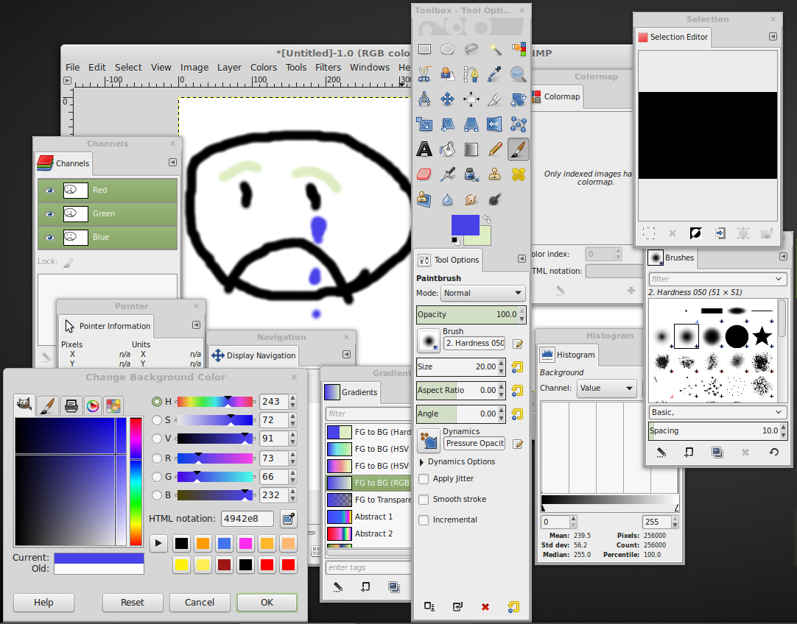

# ezpaint
Simple paint program in a webpage

# [PROPOSAL](PROPOSAL.md)

## Features

### _Unleash your Artistic Potential_

[This isn't 1984](https://en.wikipedia.org/wiki/MacDraw). EZPaint boldy steps beyond the world of black and white, with a dazzling set of primary _and_ secondary colors! But hold on. You thought you were getting a good deal? EZPaint is shipping today with a bonus - two extra "colors": black & white! There's no need to hold back with eight colors at your disposal; take your inner Picaso outwards with NEW EZPainter.

### _Cross Platform!_

Java's only cross platform if the platform implements the JVM. EZPaint's just like Java, but instead of the JVM, the user must have the EZPaint-VM. A new era of painting strikes the world with the release of EZPaint and its virtual machines.

Current implementations of the EZPaint-VM include:

* Firefox
* Chrome
* Safari
* Opera
* Internet Explorer

### _User Friendly!_

Confronting users with too many choices risks the chance of overloading their minds and causing **NEURAL BURNOUT**. 

_look away while yee still may_

EZPaint keeps users' brains **ICY COOL** by offering only the most delicious choices.

